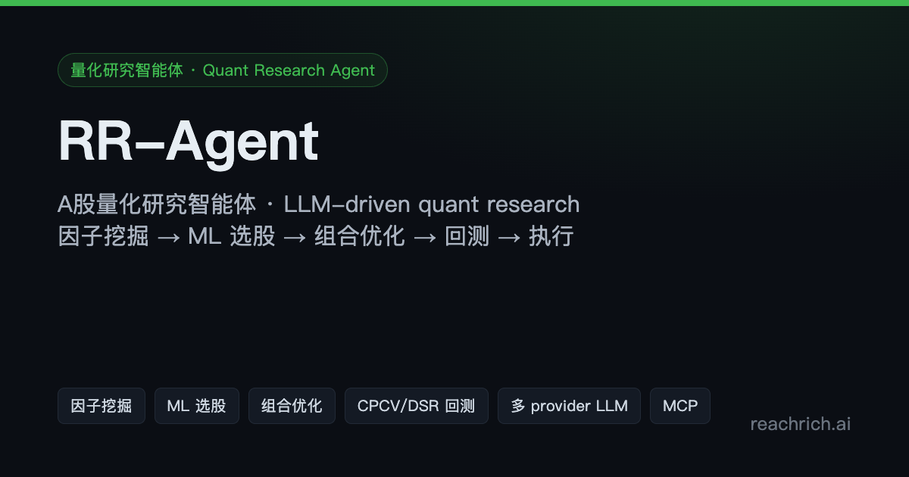
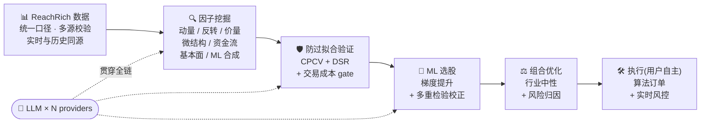
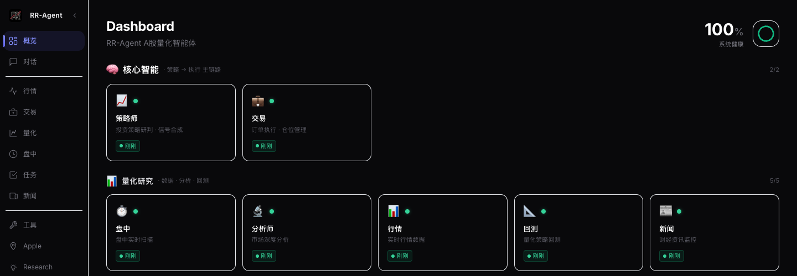
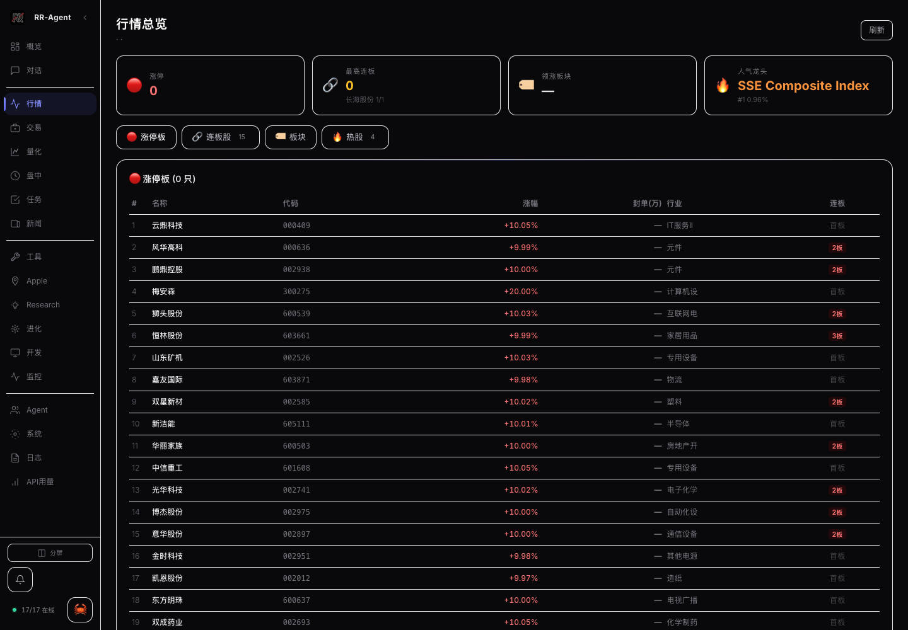
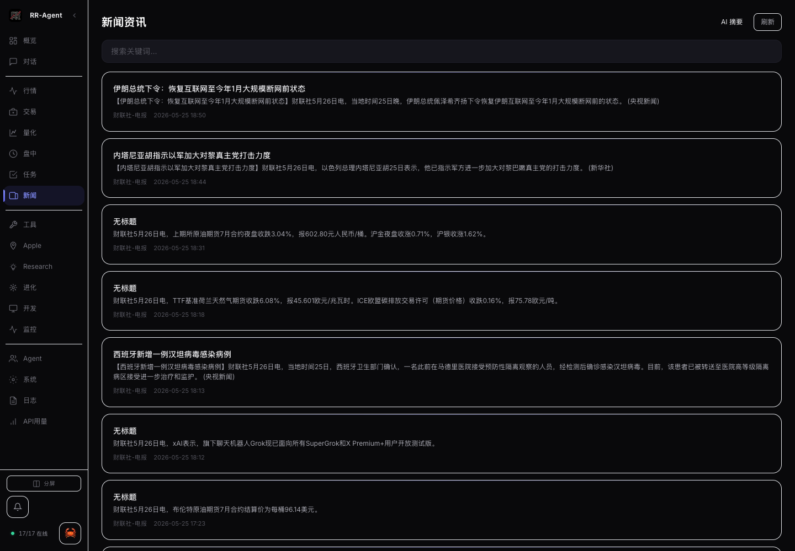

<p align="center">
  
</p>

<h1 align="center">RR-Agent</h1>

<p align="center">
  <b>自研 A 股量化研究工作台 · Self-developed Quant Research Workbench for China A-shares</b><br>
  <sub>因子库 → ML 选股 → 组合优化 → CPCV/DSR 回测 → 算法执行</sub>
</p>

<p align="center">
  <a href="https://agent.show.reachrich.ai/"></a>
  <a href="https://agent.show.reachrich.ai/insights/"></a>
  <a href="https://reachrich.ai"></a>
</p>

<p align="center">
  
  
  
  
  
</p>

---

> 🪟 **公开展示项目(Showcase)** — 本仓库仅为 RR-Agent 能力展示,**非完整代码、非真实数据、非真实因子**;不含后端代码、模型权重、凭证或部署信息。完整产品见 [reachrich.ai](https://reachrich.ai)。
>
> 所有功能、数据、因子、回测与图表仅供数据研究用途,**不构成投资建议、投资参考、荐股或代客理财**;投资决策与盈亏由使用者自行判断与承担。

## 📌 是什么

RR-Agent 是面向 A 股的 **自研量化研究工作台**:多年量化研究经验沉淀的**因子库** + ML 选股 + CPCV/DSR 严格回测 + 行业中性组合优化 + 算法订单执行;数据由 [ReachRich](https://reachrich.ai) 多源校验保证一致性;提供 Web 控制台、命令行、API 与 MCP 多端接入。

它不是黑盒信号源,而是一套**研究工作台**:方法可解释、口径可披露、结果可对账。多 provider 大模型作为**研究助手工具**贯穿全链(LLM 是工具,非产品身份)。

## 🔬 研究全链



## 🚀 立即体验

| 入口 | 说明 |
|---|---|
| **[▶ 在线 Demo](https://agent.show.reachrich.ai/)** | RR-Agent 真实前端控制台(概览 / 行情 / 量化 / 盘中 / 资讯)· 演示数据 · 纯前端不连后端 |
| **[📚 洞察文章](https://agent.show.reachrich.ai/insights/)** | 6 篇 cornerstone 方法论科普(因子挖掘 / 回测 / 组合优化 / LLM 辅助 / 风控 / 共线性) |
| **[📖 完整文档](docs/rr-agent.md)** | 总览 / 方法论 / 因子库 / 接口 / 应用场景 / FAQ |

## 🖼️ 界面

控制台总览:



<details>
<summary>📊 <b>更多截图</b>(行情 / 资讯)</summary>

<br>

行情视图(RR-Agent 在 ReachRich 数据上的总览):



资讯与 AI 摘要:



</details>

> 真实界面截图,已脱敏(不含账户、持仓、金额、内网信息)。

## ⚙️ 接入方式

| 方式 | 适用 | 说明 |
|---|---|---|
| **Web 控制台** | 研究员日常 | 可视化研究 + 监控 + 任务管理 |
| **CLI** `rr-agent` | 自动化 / 调度 | 命令行触发研究、回测、批量任务 |
| **API** | 程序化集成 | HTTP 接入数据 / 因子 / 回测 |
| **MCP** | LLM agent | Claude / Cursor / Cline 直接调用工具链 |

→ [接口文档](docs/interfaces.md)

## 📚 洞察 · 长尾方法论科普

研究流程沉淀的方法论文章(**只讲流程不讲 alpha**,IP 不公开):

| 主题 | 关键词 |
|---|---|
| 📐 [A股量化因子挖掘:七类因子与防过拟合验证](https://agent.show.reachrich.ai/insights/factor-mining-methodology.html) | 因子挖掘 · alpha · OOS · DSR |
| 🔬 [量化回测如何防过拟合:CPCV + DSR](https://agent.show.reachrich.ai/insights/backtesting-overfitting-cpcv-dsr.html) | 回测 · 过拟合 · 多重检验 |
| ⚖️ [组合优化:行业中性与风险归因](https://agent.show.reachrich.ai/insights/portfolio-optimization-industry-neutral.html) | Barra · 行业中性 · 风险归因 |
| 🤖 [LLM 辅助因子挖掘](https://agent.show.reachrich.ai/insights/llm-assisted-factor-mining.html) | LLM · 因子构造 · 工作流 |
| 🛡️ [实时风控与算法订单](https://agent.show.reachrich.ai/insights/realtime-risk-algo-execution.html) | 算法订单 · 风控 · 熔断 |
| 🔗 [因子相关性:共线性诊断与去重](https://agent.show.reachrich.ai/insights/factor-collinearity-deduplication.html) | 共线性 · VIF · 聚类去重 |

## 🌐 数据来自 ReachRich

RR-Agent 自身不采集数据,通过 API / MCP 向 **[ReachRich 多市场数据平台](https://github.com/pagliazi/reachrich-site)** 请求行情、资讯、基本面、资金流等数据原料。两者职责分离、独立演进。

```
RR-Agent (调用方,本项目) ──→  API / MCP  ──→  ReachRich (数据底座,独立项目)
                                              ↑
                                              │
                                          reachrich.ai
```

- 数据展示子站 → [data.show.reachrich.ai](https://data.show.reachrich.ai/)
- 真实数据产品 → [reachrich.ai](https://reachrich.ai)

## 📏 研究与验证口径(三条铁律)

- ✅ 回测一律标注"回测口径",**绝不以回测冒充实盘**;实盘曲线用真实持仓 × 真实收盘价计算、可对账。
- ✅ 因子须过 **样本外(OOS) + DSR 多重检验校正 + 交易成本 gate** 方进候选池。
- ✅ 公开的是**验证方法与样本外效果**,不是因子本身——名称、公式、参数、模型权重属研究 IP,不公开。

→ [研究方法论详解](docs/methodology.md) · [量化效果(诚实口径)](docs/performance.md)

## 📁 仓库结构

```
.
├─ README.md              # 本文档
├─ README.en.md           # English
├─ docs/                  # 完整文档(GitHub 直接渲染)
├─ insights/              # 6 篇 cornerstone 文章(HTML, 经 Pages 渲染)
├─ assets/                # 截图 / og 图 / logo / 实盘曲线
├─ demo/                  # 真实前端控制台(经 Pages 渲染)
├─ sitemap.xml / robots.txt / llms.txt
└─ SECURITY.md / LICENSE
```

## ⚠️ 免责声明

本仓库为量化数据研究与产品能力展示,所有内容仅供数据研究用途,**不作为任何投资参考依据**。投资有风险,历史业绩不代表未来;不对任何收益、回报或本金安全作出承诺;展示中的回测数据为回测口径、非实盘,实盘表现通常低于回测;不构成投资建议、投资参考、荐股或收益承诺。

## 📄 License

[MIT](LICENSE) — Showcase 仓库,不含产品本体代码。
安全披露见 [SECURITY.md](SECURITY.md)。

---

<p align="center">
  <sub><b>持有证券投资咨询(投顾)牌照 · 不代客操盘 · 不保本承诺</b></sub><br>
  <sub>© 2026 ReachRich · <a href="https://reachrich.ai">reachrich.ai</a> · <a href="https://github.com/pagliazi/reachrich-site">数据平台</a></sub>
</p>
