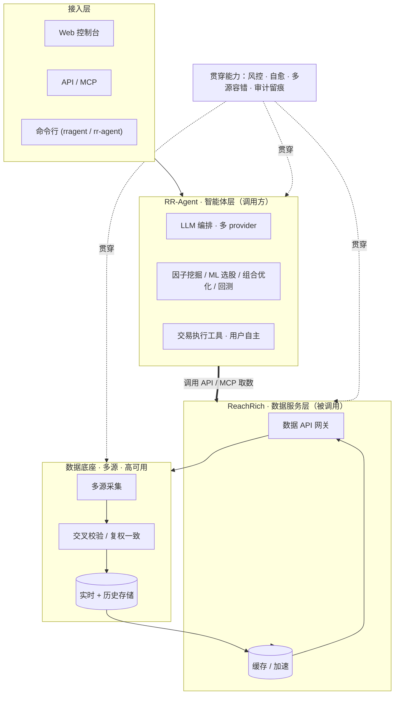

# 系统架构（高层概念）

> 仅展示**高层逻辑分层与调用关系**，**不涉及主机、IP、内网拓扑、技术栈或部署细节**。

## 分层与调用

## 关键设计（健壮性）

- **调用解耦**：RR-Agent（智能体）通过 API / MCP **调用** ReachRich（数据服务），两者职责分离、独立演进。
- **多源容错**：数据底座多源采集 + 交叉校验，单源异常自动降级/切换。
- **缓存加速**：高频/可缓存数据经缓存层，降低回源压力。
- **自愈与监控**：核心服务异常自动恢复 + 中央健康监测 + 告警。
- **审计留痕**：交易与信号可追溯、可对账。

> 本页为概念性分层说明，用于理解系统职责与调用关系；不代表也不公开实际部署架构。
