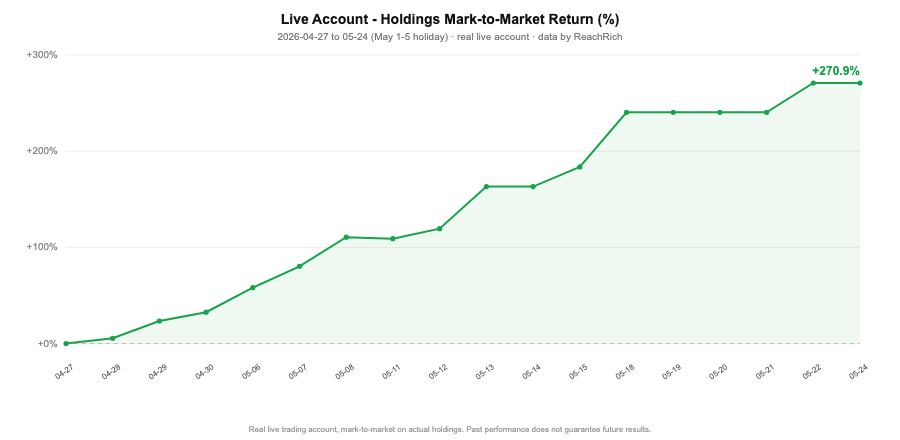

# 量化效果（数据研究）

> 本页为**数据研究展示**，**仅供研究用途，不作为投资参考依据**；历史业绩不代表未来；不构成投资建议或荐股，**不承诺任何收益**。

## 实盘盈亏走势（真实账户）

- **真实实盘账户**，持仓**盯市收益率**（基于真实持仓与每日收盘价，**仅百分比、不含金额/持仓明细**）。
- 区间 **2026-04-27 ~ 05-24**（5/1–5/5 劳动节休市），盯市收益率 **0% → +270.9%**。
- 行情与计算数据由 **ReachRich** 平台提供。

## 因子库（匿名展示）

因子库覆盖多类型，均经 **DSR（Deflated Sharpe）多重检验校正**与**样本外验证**。出于知识产权保护，仅展示类型与状态，不公开名称、公式与参数：

| 因子 | 类型 | 状态 | 样本外口径 |
|---|---|---|---|
| Factor A-07 | 微结构 | OOS 验证通过 | OOS-IC 正，DSR PASS |
| Factor B-12 | ML 合成 | OOS 验证通过 | DSR p<0.05 |
| Factor C-03 | 资金流 | 观察中 | — |
| Factor D-21 | 动量 | OOS 验证通过 | 多周期 IC 一致 |
| Factor E-09 | 反转 | OOS 验证通过 | 深跌放量 |
| Factor F-15 | 价量波动 | OOS 验证通过 | 振幅压缩突破 |
| Factor G-04 | 基本面 | 观察中 | — |

**类型分布**：动量 · 反转 · 价量波动 · 微结构 · 资金流 · 基本面 · ML 合成（7 大类，持续扩充）。
**质量门槛**：候选因子须通过 **样本外（OOS）验证 + DSR 多重检验校正 + 交易成本 gate** 方可进入实盘候选池；不达标进入观察/淘汰。

## 策略表现 · Top-N（回测口径）

> **以下为回测口径，非实盘；实盘表现通常低于回测。历史业绩不代表未来，本平台不对任何收益作出承诺，亦不构成投资建议。**

| 排名 | 策略类型 | 回测 Sharpe | 口径 |
|---|---|---|---|
| 1 | 动量 / 趋势启动 | **4.51** | 2025 年区间回测 |
| 2 | 组合优化（MVO，行业中性） | **3.72** | 70 日回测，5518 股 × 111 行业 |
| 3 | 多因子组合（MVO） | **2.37** | 70 日回测，命中率 57.1%，最大回撤 −1.20% |
| 4 | 风险约束组合 | **1.8+** | CPCV 交叉验证（防过拟合） |

- 入选 Top-N 的策略均经 **CPCV 交叉验证 + DSR 多重检验校正 + 交易成本 gate**（见[方法论](methodology.md)）。
- 上述为**回测**结果；我们如实标注口径，不以回测冒充实盘。**不承诺任何收益。**

## 验证方法（不涉实现）

- **CPCV**（组合purged交叉验证）：防止时间序列过拟合
- **DSR**（Deflated Sharpe）：对多重检验/选择偏差做校正
- **样本外（OOS）回放**：以未来数据检验，而非样本内
- **交易成本 gate**：扣除滑点/手续费后仍需为正
- **实盘 paper trade**：上实盘前先纸上验证

详见 [方法论](methodology.md)。
